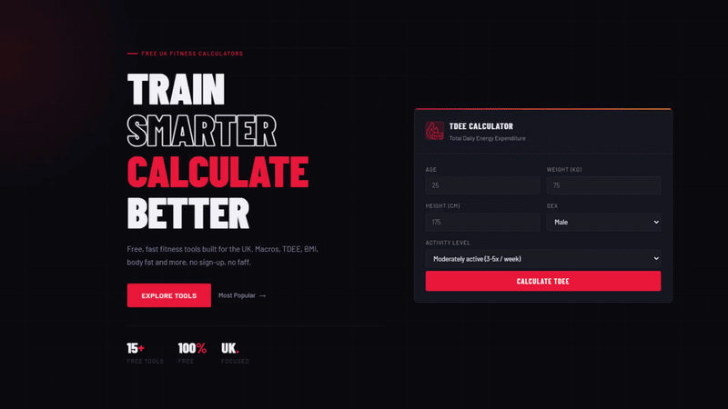
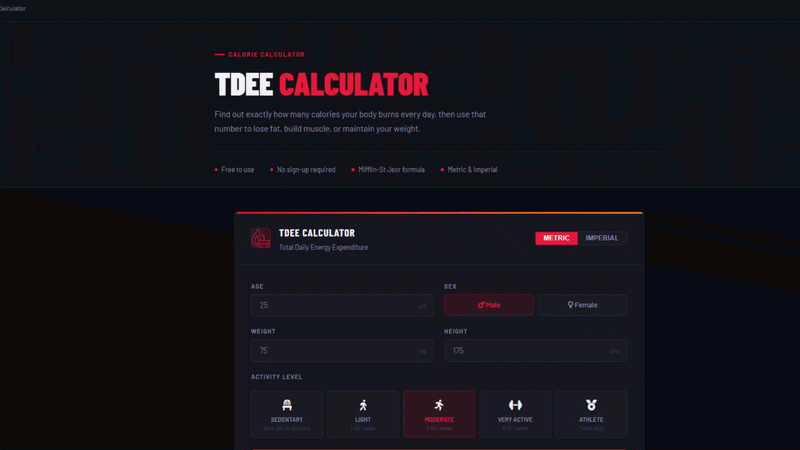
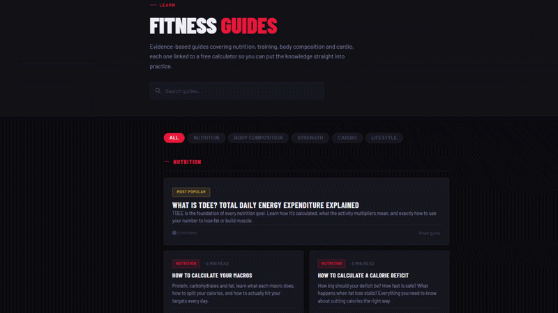

# VeltaCalc - Free UK Fitness Calculators

> Fast, accurate fitness tools and guides aimed for the UK market. No sign-ups, no ads, no clutter.

**[veltacalc.co.uk](https://veltacalc.co.uk)**

---

## Why I Built This

Every fitness calculator I could find was either buried in ads, required a sign-up, or wasn't built with UK units and guidelines in mind. I wanted something fast, clean and actually useful.

The site covers 15 tools including TDEE, macros, BMI, body fat, 1RM and more. Everything is built with vanilla HTML, CSS and JavaScript, no frameworks.

---

## Tech Stack

| Layer | Technology |
|---|---|
| Frontend | HTML, CSS, JavaScript |
| Hosting | Static file hosting |
| SEO | Manual keyword research, sitemap, 20+ guide pages |

---

## Demo

The site is live and fully functional — no login, no setup required.

### Homepage

Keyword-led and appealing landing page with TDEE calculator ready to use, followed by the other tools.
[Try it](https://veltacalc.co.uk/pages/macro-calculator)

---

### TDEE Calculator

Find out exactly how many calories you burn daily based on your stats and activity level.
[Try it](https://veltacalc.co.uk/pages/tdee-calculator)

---

### Guides

20 guides to help users understand calculations and what the results mean for them.
[Try it](https://veltacalc.co.uk/pages/one-rep-max-calculator)

---

## The Real Challenge, Getting People to Find It

Building the tools was the straightforward part. The harder problem was traffic.

A site lives or dies by search visibility, so I had to get serious about SEO. This included researching keywords, writing 20+ guide pages that target specific search queries, building a proper sitemap, and working on getting the site indexed and ranking on Google.

It's an ongoing process and honestly one of the more interesting problems I've worked on. It's a different kind of engineering, but it's still problem-solving.

---

## Future Improvements

- [ ] Display advertising once traffic thresholds are met
- [ ] Affiliate integrations within guide content
- [ ] Expanded guide library targeting more search queries
- [ ] Sign up and premium features — saved results, personalised plans
- [ ] Integration with a companion workout tracking app currently in development

---

## Tools & Assistance
Built solo. AI assistance is used for boilerplate, debugging, and content drafting. 
All architecture, product, and SEO decisions are made independently.

## Note on Source Code

This is a demo repository. The full source code is kept private as VeltaCalc is an active commercial project. This README exists to give an overview of the project, the problem it solves, and the thinking behind it. I'd love to hear what you think and any feedback!

---

*Built and maintained solo by [Keegan Doherty](https://keegandoherty.com)*
